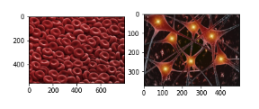
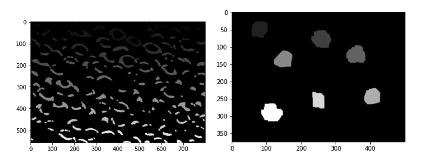

# Computer-Vision-Object-Detection-and-Counting

A deterministic algorithm pipeline is presented to count the number of distinct objects in an image.
This pipeline is designed to solve the challenges of segmenting images with overlapping objects containing high noise and non-trivial color distributions. It employs otsu thresholding and morphological operators as pre-processing to pull
out objects and high-intensity manifolds and to collapse false manifolds or noise that could cause the algorithm to overestimate the number of images.  

## Input Control Images

Here we attempt to count the number of distinct objects in two control images.

1. The number of red blood cells (Left Image)
2. The number of neurons (Right Image)

## Output / Modified Images

These are the modified images after being moved through the pre-processing pipeline. Each object is represented by a high-intensity neighborhood and the number of objects can be derived using connected component analysis or some other clusering method.

## Results

Number of Red Blood Cells  = 195

Number of Neurons  = 7

